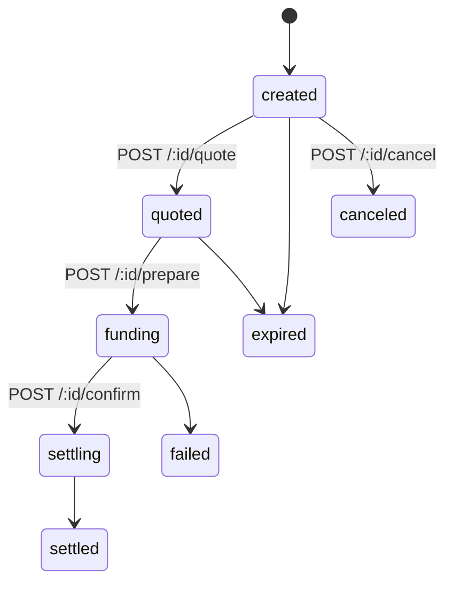
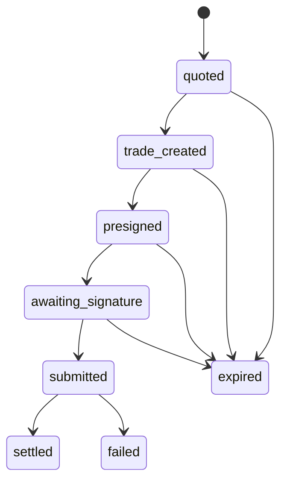

# State diagrams

Two lifecycles, not one — the settlement intent and the FX trade nested inside it move
independently.

## Settlement intent



## FX trade (nested inside quoted -> settled above)



Illegal transitions are rejected in code, not just documented — `fx_trades.state` only
ever moves forward along the arrows above (or into `expired`/`failed`), never sideways or
backward.

**What happens if the process dies between `prepare` and `confirm`:** nothing
automatically recovers it today. The `fx_trades` row sits in `presigned` (or
`awaiting_signature`) state forever. A sweeper for stale rows past `quote_expires_at`
doesn't exist yet — this is a real, open gap, not an oversight buried in code. Money
isn't at risk (nothing was funded on-chain yet at that point in the flow — funding only
happens in `confirm`), but the intent will look permanently stuck rather than cleanly
`expired` until that sweeper is built.


## Payroll run

```
                 ┌──────────────────────────────────────┐
                 │                                      │
  draft ──execute──> executing ──all lines paid──> completed
    ▲                    │
    │                    ├──some paid, some not──> partial
    │                    │
    │                    └──none paid───────────> failed
    │                    │
    └──build fails───────┘
```

`draft` is where a run waits to be read. Amounts are frozen when it is created,
so a raise afterwards cannot change what the run says it owed.

`executing` is claimed by a **run key**, which the database refuses a second time.
That refusal is what makes a double-clicked button harmless. A failure while
building the legs releases the run back to `draft` and frees its key — the error
moved no money, and leaving it claimed would make the run neither runnable nor
retryable.

`partial` is an outcome, not an error. Currencies are dispersed in groups and one
can land while another does not; calling that `failed` lies to the people who
were paid and `completed` lies to the people who were not. The status is derived
from the line statuses rather than reported separately, so the two cannot come to
disagree about whether somebody was paid.

Running payroll again pays only the lines that are still unpaid.

## Payout

```
  (destination added) ──unverified──> cannot be paid to
             │
             └──owner signs a challenge──> verified
                                              │
  payout: pending ──transfer found on chain──> paid
             │
             └──never signed────────────────> stays pending
```

A payout that was authorised and never signed stays `pending` forever, which is
the honest state for it: nothing moved. `paid` requires a transaction the server
found on chain containing that exact transfer — a hash on its own is a claim.
