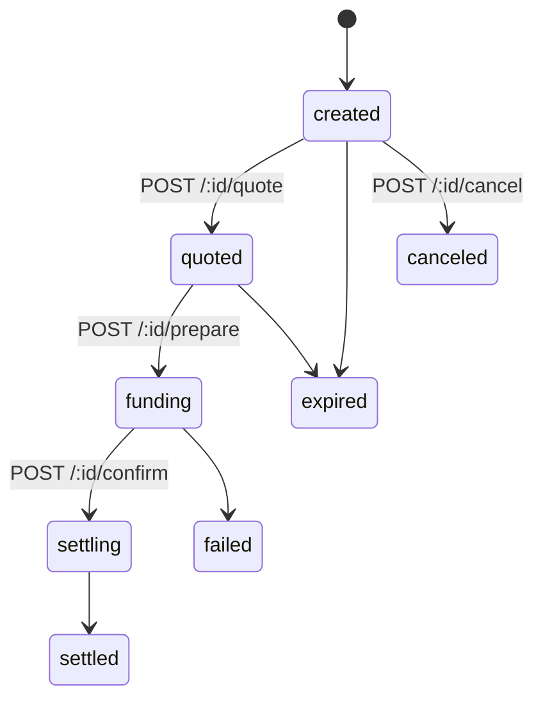
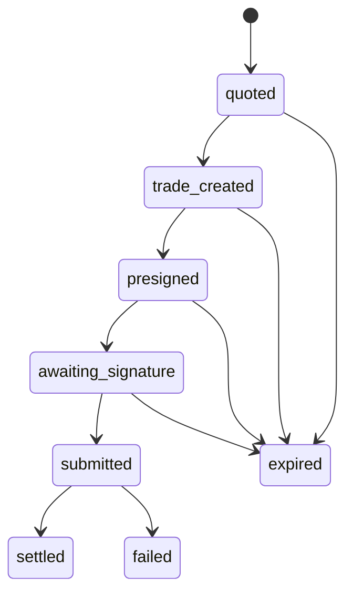

# State diagrams

Two lifecycles, not one — the settlement intent and the FX trade nested inside it move
independently.

## Settlement intent

## FX trade (nested inside quoted -> settled above)

Illegal transitions are rejected in code, not just documented — `fx_trades.state` only
ever moves forward along the arrows above (or into `expired`/`failed`), never sideways or
backward.

**What happens if the process dies between `prepare` and `confirm`:** nothing
automatically recovers it today. The `fx_trades` row sits in `presigned` (or
`awaiting_signature`) state forever. A sweeper for stale rows past `quote_expires_at`
doesn't exist yet — this is a real, open gap, not an oversight buried in code. Money
isn't at risk (nothing was funded on-chain yet at that point in the flow — funding only
happens in `confirm`), but the intent will look permanently stuck rather than cleanly
`expired` until that sweeper is built.
